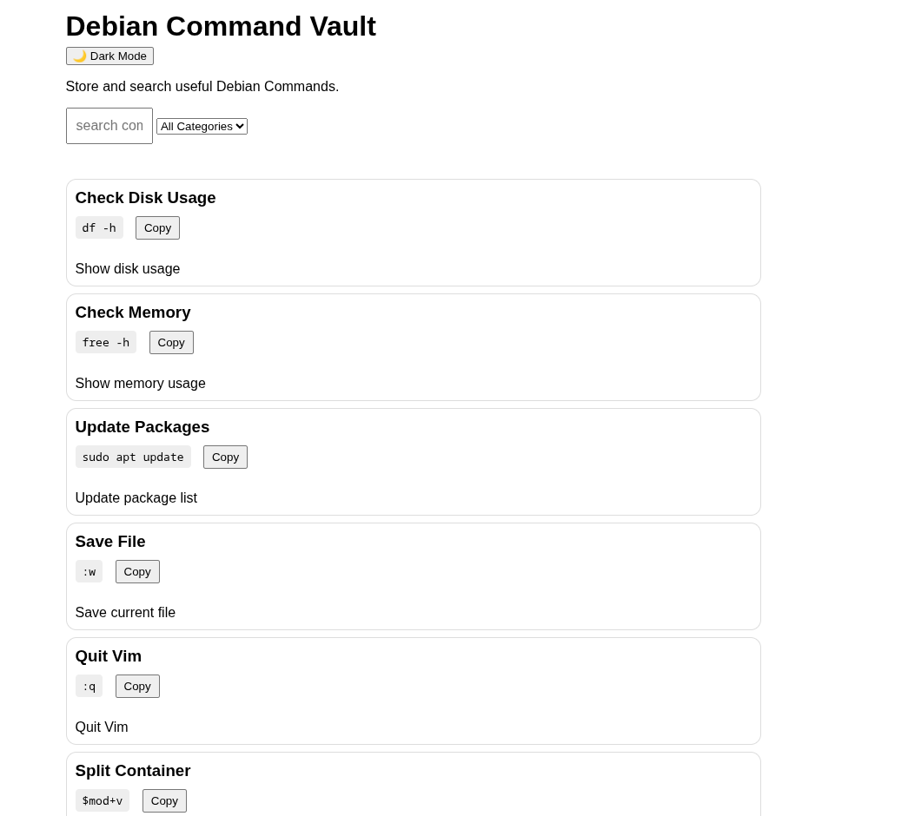
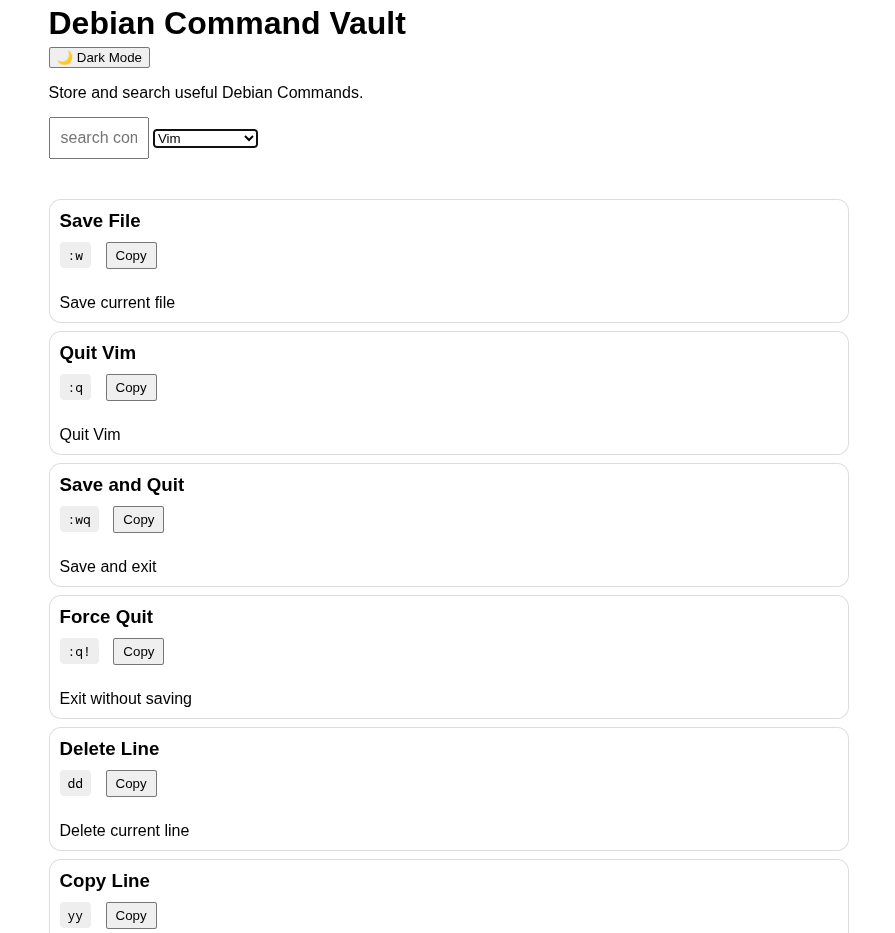
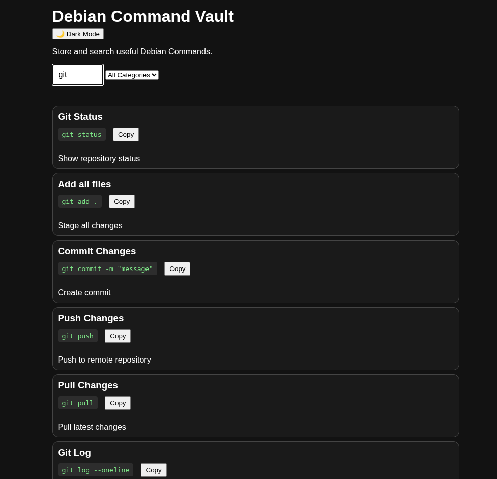

# Debian Command Vault 🐧

A lightweight Linux command reference built with Go, HTML, CSS, and JavaScript.

The goal of this project is to provide a simple and searchable vault of useful Linux commands.

## Features

- ✅ Go Backend
- ✅ SQLite Database (auto-seeded from JSON)
- ✅ REST API (full CRUD)
- ✅ Command Search
- ✅ Category Filter
- ✅ Dark Mode (persisted)
- ✅ Copy Command Button
- ✅ Add / Delete Commands
- ✅ Category Badges
- ✅ Command Counter
- ✅ Docker Support
- ✅ Responsive Card Layout

## Technology Stack

| Technology | Purpose |
|------------|----------|
| Go | Backend Server |
| SQLite | Database |
| HTML | Frontend Structure |
| CSS | Styling |
| JavaScript | UI Interaction |
| Docker | Containerization |
| Git | Version Control |
| GitHub | Repository Hosting |

## REST API

| Method | Endpoint | Description |
|--------|----------|-------------|
| GET | `/api/commands` | List all commands |
| GET | `/api/commands/{id}` | Get one command |
| POST | `/api/commands` | Create a command |
| PUT | `/api/commands/{id}` | Update a command |
| DELETE | `/api/commands/{id}` | Delete a command |

## Development Progress

### Stage 1 — Foundation ✅

Completed: Go API, JSON Storage, HTML Frontend, CSS Cards, Search Commands, GitHub Repository, README, License and Git Ignore.

Status: 100% Complete

### Stage 2 — Feature Expansion ✅

Completed: Search, Category Filter, Dark Mode, Copy Button, Add Command, Delete Command, Category Badge and Command Counter.

Status: 100% Complete

### Stage 3 — Production Ready ✅

Completed: SQLite Database, Full REST API (CRUD), Docker Support, Auto-seed from JSON.

Status: 100% Complete

## Screenshots





## Installation

### Local

```bash
git clone https://github.com/USERNAME/debian-command-vault.git
cd debian-command-vault
go run ./cmd/server/
```

Open http://localhost:8080

### Docker

```bash
docker compose up --build
```

Open http://localhost:8080

## Why This Project Exists

Many Linux users repeatedly search for the same commands: grep, find, tar, chmod, chown, systemctl and journalctl.
This project keeps those commands organized in one place.

## Contributing

Contributions are welcome. You can help by:

1. Adding useful Linux commands
2. Improving UI
3. Reporting bugs
4. Suggesting new features
5. Improving documentation

Pull Requests are welcome.

## Learning Journey

This project is part of my journey learning Go, SQLite, REST APIs, HTML, CSS, JavaScript, Docker, Git, and Open Source Development.

## License

MIT License
